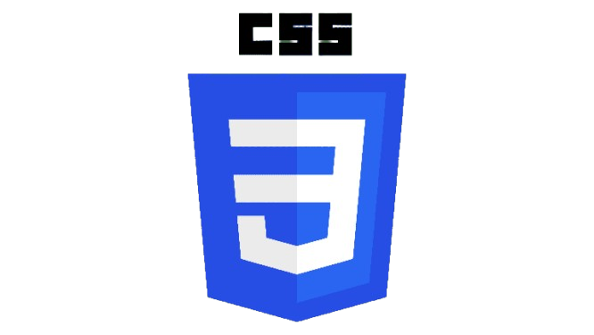

  <picture>
    <source media="(prefers-color-scheme: dark)" srcset="https://readme-typing-svg.herokuapp.com?font=Inter&weight=600&size=30&pause=1000&color=FFFFFF&center=true&vCenter=true&width=600&height=60&lines=Hi+there,+I'm+Rajdeep+Dey.;Full+Stack+%26+Flutter+Developer;Passionate+about+Scalable+Apps">
    <source media="(prefers-color-scheme: light)" srcset="https://readme-typing-svg.herokuapp.com?font=Inter&weight=600&size=30&pause=1000&color=000000&center=true&vCenter=true&width=600&height=60&lines=Hi+there,+I'm+Rajdeep+Dey.;Full+Stack+%26+Flutter+Developer;Passionate+about+Scalable+Apps">
    
  </picture>
  
<em>Crafting beautiful and scalable mobile and web applications</em>

  
<h2 align="center">A B O U T &nbsp; M E</h2>
 

- Currently pursuing my **BCA** from **Future Institute of Engineering and Management**.
- **Technical Focus:** I am deeply passionate about building robust, scalable mobile and web applications. My core expertise lies in crafting seamless frontends using **Flutter**, **React**, and Vanilla JS, coupled with designing highly optimized backend architectures using **FastAPI** and **PostgreSQL**.
- **Problem Solving:** I thrive on translating complex, real-world problems into clean, efficient, and maintainable code.
- **Art & Cinema:** Outside of coding, I am an avid lover of art and cinema, often drawing creative inspiration for my UI designs from cinematic storytelling and visual arts.
- **Politics:** I maintain a keen interest in global politics, staying informed about how policy changes shape the world and the tech industry.
- **Sports:** I am a sports enthusiast, which fuels my competitive spirit, teamwork, and drive for continuous improvement.

  
<h2 align="center">T E C H &nbsp; S T A C K</h2>
 

   
  &nbsp;&nbsp;&nbsp;&nbsp;
  &nbsp;&nbsp;&nbsp;&nbsp;
  &nbsp;&nbsp;&nbsp;&nbsp;
  &nbsp;&nbsp;&nbsp;&nbsp;
  &nbsp;&nbsp;&nbsp;&nbsp;
  &nbsp;&nbsp;&nbsp;&nbsp;
  &nbsp;&nbsp;&nbsp;&nbsp;
  
   

  
<h2 align="center">P R O J E C T S</h2>
 

  
#### ⬢ [AttendX24](https://github.com/stars/rajdeep-py/lists/attendance-management-software)
> A smart HRMS through which users can check in and check out using fingerprint, face recognition, and background location permissions. Employees can request leaves, view the holiday calendar, and check their attendance records. The admin panel allows organizations to log in, onboard and manage employees, track attendance, download attendance sheets, and manage leave requests.
>   
> &nbsp; &nbsp; 

 

#### ⬢ [Online Book Store](https://github.com/stars/rajdeep-py/lists/book-heaven)
> A comprehensive online bookstore website where customers can browse books, add to cart, create an account, place orders, and log in to view their profile and order history. It includes an admin panel to manage book inventory, orders, customers, the "About Us" page, and partners. 
>   
> &nbsp; &nbsp; &nbsp; *(+ JSP Servlet & MySQL)*

 

#### ⬢ [Women Safety App](https://github.com/stars/rajdeep-py/lists/flutter-apps)
> A mobile application focused on user safety. Users can log in and join communities to explore the feed. On pressing the volume up/down button, it triggers an emergency sequence: initiating live video recording and sharing real-time location with pre-configured trusted contacts using background permissions.
>   
> &nbsp; *(Frontend Only)*

 

#### ⬢ [Captain App](https://github.com/stars/rajdeep-py/lists/flutter-apps)
> An intuitive mobile application enabling riders to log in, go online, and accept ride orders or parcel delivery requests from customers. 
>   
> &nbsp; *(Frontend Only)*

  
<h2 align="center">M E T R I C S</h2>
 

  <picture>
    <source media="(prefers-color-scheme: dark)" srcset="https://github-readme-stats.vercel.app/api?username=rajdeep-py&show_icons=true&title_color=ffffff&text_color=ffffff&icon_color=ffffff&bg_color=000000&hide_border=true&border_radius=0">
    <source media="(prefers-color-scheme: light)" srcset="https://github-readme-stats.vercel.app/api?username=rajdeep-py&show_icons=true&title_color=000000&text_color=000000&icon_color=000000&bg_color=ffffff&hide_border=true&border_radius=0">
    
  </picture>
  &nbsp;&nbsp;
  <picture>
    <source media="(prefers-color-scheme: dark)" srcset="https://github-readme-stats.vercel.app/api/top-langs/?username=rajdeep-py&layout=compact&title_color=ffffff&text_color=ffffff&bg_color=000000&hide_border=true&border_radius=0">
    <source media="(prefers-color-scheme: light)" srcset="https://github-readme-stats.vercel.app/api/top-langs/?username=rajdeep-py&layout=compact&title_color=000000&text_color=000000&bg_color=ffffff&hide_border=true&border_radius=0">
    
  </picture>
    
  <picture>
    <source media="(prefers-color-scheme: dark)" srcset="https://github-readme-streak-stats.herokuapp.com/?user=rajdeep-py&background=000000&stroke=ffffff&ring=ffffff&fire=ffffff&currStreakNum=ffffff&sideNums=ffffff&currStreakLabel=ffffff&sideLabels=ffffff&dates=ffffff&hide_border=true&border_radius=0">
    <source media="(prefers-color-scheme: light)" srcset="https://github-readme-streak-stats.herokuapp.com/?user=rajdeep-py&background=ffffff&stroke=000000&ring=000000&fire=000000&currStreakNum=000000&sideNums=000000&currStreakLabel=000000&sideLabels=000000&dates=000000&hide_border=true&border_radius=0">
    
  </picture>

  
<h2 align="center">L E T 'S &nbsp; C O N N E C T</h2>
 

  
<em>Let's build something amazing together.</em>

   
  
  &nbsp;&nbsp;&nbsp;&nbsp;&nbsp;&nbsp;&nbsp;&nbsp;
  
  &nbsp;&nbsp;&nbsp;&nbsp;&nbsp;&nbsp;&nbsp;&nbsp;
  

 

  <em>"Any fool can write code that a computer can understand. Good programmers write code that humans can understand."</em> 
  — <b>Martin Fowler</b>

